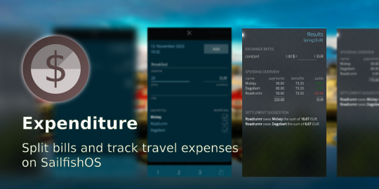

<!--
SPDX-FileCopyrightText: 2018-2025 Mirian Margiani
SPDX-FileCopyrightText: 2022 Tobias Planitzer
SPDX-FileCopyrightText: 2023 yajo10
SPDX-License-Identifier: GFDL-1.3-or-later
-->

# Expenditure for Sailfish OS

Expenditure is a simple app for tracking expenses in groups

Expenditure is a helpful companion for tracking and splitting bills, project or
trip expenses among groups with extended support for multiple currencies. This
comes in handy e.g. on a group-trip through different countries while at the
same time keeping track of other bills at home.

**Features:**

- create multiple projects with different members
- add and edit expenses
- use multiple currencies with constant or date-specific exchange rates
- calculate total and individual spending overview
- generate settlement suggestion
- backup and restore project expenses
- share report

## Permissions

Expenditure requires the following permissions:

- PublicDir, UserDirs, RemovableMedia: to save exported reports

  # Splitwise Sync Setup Guide for Expenditure

This guide will help you set up automatic synchronization between the Expenditure app and Splitwise.

## What You'll Need

- A Splitwise account (free at https://www.splitwise.com)
- About 10 minutes
- A computer or your Sailfish device with terminal access

---

## Part 1: Get Splitwise API Credentials

### Step 1: Register Your Application

1. **Open your web browser** and go to: https://secure.splitwise.com/apps

2. **Log in** to your Splitwise account if prompted

3. **Click** the button that says **"Register your application"**

4. **Fill in the registration form:**

| Field | What to Enter |
|-------|---------------|
| **Application name** | `Expenditure Sync` (or any name you prefer) |
| **Description** | `Personal app to sync Expenditure with Splitwise` |
| **Homepage URL** | `http://localhost` |
| **Callback URL** | `http://localhost/callback` |

> **Note:** The URLs above are correct! They're used for the OAuth flow and don't need to be real websites.

5. **Click "Save" or "Register"**

6. **Copy your credentials** - You'll see two values displayed:
- **Consumer Key** (looks like: `AnZ0vBRE4XKrIbpIOOVmjXG2E4FEFw058Zi7EM3z`)
- **Consumer Secret** (looks like: `zFasvrF0PaB0HuxoOF2jYDFPHTVGlGsXOQoCo2De`)

⚠️ **IMPORTANT:** Keep these secret! Don't share them publicly.

---

## Part 2: Get OAuth Access Tokens

### Step 1: Install Python Dependencies

**On your computer:**

pip3 install requests-oauthlib
**OR on Sailfish device:**
devel-su
pkcon install python3-requests-oauthlib
exit
### Step 2: Download the Token Generator Script

Download `get_splitwise_tokens.py` from the repository:
curl -LO https://raw.githubusercontent.com/smatkovi/harbour-expenditure/main/tools/get_splitwise_tokens.py
OR copy it from the `tools/` folder in the repository.

### Step 3: Run the Script
python3 get_splitwise_tokens.py
### Step 4: Follow the Interactive Prompts

The script will guide you through the following:

#### Prompt 1: Enter Consumer Key
→ **Paste** the Consumer Key from Step 1 (from the Splitwise website)

#### Prompt 2: Enter Consumer Secret
→ **Paste** the Consumer Secret from Step 1

#### Prompt 3: Authorize in Browser
The script will display a URL like:
1. **Copy** this entire URL
2. **Paste** it into your web browser
3. **Click "Authorize"** on the Splitwise page
4. You'll be redirected to a page that says "This site can't be reached" - **THIS IS NORMAL!**

#### Prompt 4: Copy Redirect URL
Look at your browser's address bar. It will show something like:
http://localhost/callback?oauth_token=abc123&oauth_verifier=xyz789

1. **Copy** this ENTIRE URL from the address bar
2. **Paste** it into the script when prompted:
### Step 5: Get Your Tokens

The script will now display all your credentials:
for example
============================================================
SUCCESS! Your OAuth tokens:

CONSUMER_KEY = "AnZ0vBRE4XKrIbpIOOVmjXG2E4FEFw058Zi7EM3z"
CONSUMER_SECRET = "zFasvrF0PaB0HuxoOF2jYDFPHTVGlGsXOQoCo2De"
OAUTH_TOKEN = "a4ZVh7h9FvdFtiyfBmkEVPOAVW8KbLoSEsxTmlW2"
OAUTH_TOKEN_SECRET = "HZ6czJhTHy6yfRXqosnzhRRXOYwkn4KYwxxMlFVS"
**SAVE THESE!** You'll need them in the next step.

The script will also show your Splitwise groups:
**Note the Group ID** for the group you want to sync with Expenditure.

---

## Part 3: Configure Expenditure

### Option A: Manual Installation (Most Users)

#### Step 1: Copy Configuration File

On your Sailfish device:
devel-su
cd /usr/share/harbour-expenditure/qml/py
cp splitwise_config.py.example splitwise_config.py

#### Step 2: Edit Configuration
vim splitwise_config.py
FROM THIS:

CONSUMER_KEY = "YOUR_CONSUMER_KEY_HERE"
CONSUMER_SECRET = "YOUR_CONSUMER_SECRET_HERE"
OAUTH_TOKEN = "YOUR_OAUTH_TOKEN_HERE"
OAUTH_TOKEN_SECRET = "YOUR_OAUTH_TOKEN_SECRET_HERE"
GROUP_ID = 0
TO THIS (with your actual values):

CONSUMER_KEY = "AnZ0vBRE4XKrIbpIOOVmjXG2E4FEFw058Zi7EM3z"
CONSUMER_SECRET = "zFasvrF0PaB0HuxoOF2jYDFPHTVGlGsXOQoCo2De"
OAUTH_TOKEN = "a4ZVh7h9FvdFtiyfBmkEVPOAVW8KbLoSEsxTmlW2"
OAUTH_TOKEN_SECRET = "HZ6czJhTHy6yfRXqosnzhRRXOYwkn4KYwxxMlFVS"
GROUP_ID = 89224428 # Your group ID from Step 5
Save and exit (`:wq` in vi).

#### Step 3: Configure Group ID in QML (Optional)

If you want to override the group ID in the QML component:
vim /usr/share/harbour-expenditure/qml/components/SplitwiseSync.qml
Find line 11:
property int groupId: 0 // SET YOUR GROUP ID HERE
Change to:
property int groupId: 89224428 // Your actual group ID

## Acknowledgements

This app was originally created by Tobias Planitzer since 2022 up until version
0.2. An intermediate version 0.3 was released by yajo10 in 2023. Development
is continued by Mirian Margiani (ichthyosaurus) since 2023.

## Help and support

You are welcome to [leave a comment in the forum](https://forum.sailfishos.org/t/apps-by-ichthyosaurus/15753)
if you have any questions or ideas.

## Translations

It would be wonderful if the app could be translated in as many languages as possible!

Translations are managed using
[Weblate](https://hosted.weblate.org/projects/harbour-expenditure/translations).
Please prefer this over pull request (which are still welcome, of course).
If you just found a minor problem, you can also
[leave a comment in the forum](https://forum.sailfishos.org/t/apps-by-ichthyosaurus/15753)
or [open an issue](https://github.com/ichthyosaurus/harbour-expenditure/issues/new).

Please include the following details:

1. the language you were using
2. where you found the error
3. the incorrect text
4. the correct translation

### Manually updating translations

Please prefer using
[Weblate](https://hosted.weblate.org/projects/harbour-expenditure) over this.
You can follow these steps to manually add or update a translation:

1. *If it did not exist before*, create a new catalog for your language by copying the
   base file [translations/harbour-expenditure.ts](translations/harbour-expenditure.ts).
   Then add the new translation to [harbour-expenditure.pro](harbour-expenditure.pro).
2. Add yourself to the list of contributors in [qml/pages/AboutPage.qml](qml/pages/AboutPage.qml).
3. (optional) Translate the app's name in [harbour-expenditure.desktop](harbour-expenditure.desktop)
   if there is a (short) native term for it in your language.

See [the Qt documentation](https://doc.qt.io/qt-5/qml-qtqml-date.html#details) for
details on how to translate date formats to your *local* format.

## Building and contributing

*Bug reports, and contributions for translations, bug fixes, or new features are always welcome!*

1. Clone the repository by running `git clone https://github.com/ichthyosaurus/harbour-expenditure.git`
2. Open `harbour-expenditure.pro` in Sailfish OS IDE (Qt Creator for Sailfish)
3. To run on emulator, select the `i486` target and press the run button
4. To build for the device, select the `armv7hl` target and click “deploy all”;
   the RPM packages will be in the `RPMS` folder

If you contribute, please do not forget to add yourself to the list of
contributors in [qml/pages/AboutPage.qml](qml/pages/AboutPage.qml)!

## Donations

If you want to support my work, I am always happy if you buy me a cup of coffee
through [Liberapay](https://liberapay.com/ichthyosaurus).

Of course it would be much appreciated as well if you support this project by
contributing to translations or code! See above how you can contribute 🎕.

## License

> Copyright (C) 2023-2025  Mirian Margiani
>
> Copyright (C) 2022  Tobias Planitzer

Expenditure is Free Software released under the terms of the
[GNU General Public License v3 (or later)](https://spdx.org/licenses/GPL-3.0-or-later.html).
The source code is available [on Github](https://github.com/ichthyosaurus/harbour-expenditure).
All documentation is released under the terms of the
[GNU Free Documentation License v1.3 (or later)](https://spdx.org/licenses/GFDL-1.3-or-later.html).

This project follows the [REUSE specification](https://api.reuse.software/info/github.com/ichthyosaurus/harbour-expenditure).
